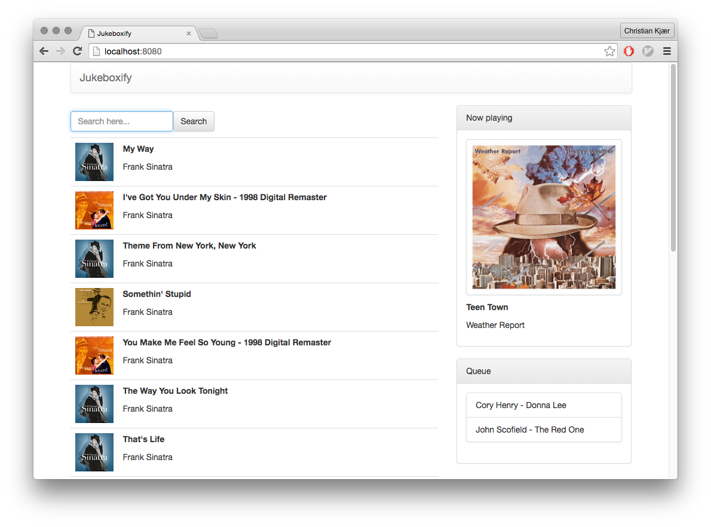
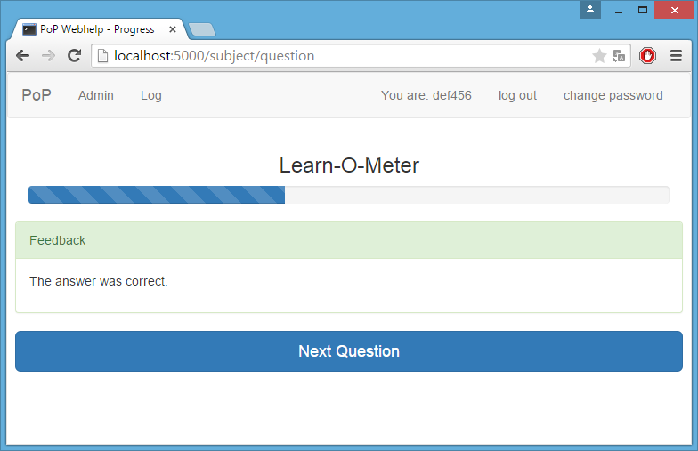

APLite
------
APL-like language

Very much work-in-progress. Right now only the parser kind of works.

https://github.com/christiankjaer/aplite

Jukeboxify
----------

Web application written in JavaScript with React_ and a Python backend using pyspotify_.

https://github.com/christiankjaer/Jukeboxify

PoP Webhelp
-----------

First year project in a software engineering course. We created a piece of interactive
learning software for an introductory course in programming.

It was written in Python using the Flask_ microframework.

https://github.com/christiankjaer/pop-webhelp

.. _Flask: http://flask.pocoo.org/
.. _React: https://facebook.github.io/react/
.. _pyspotify: https://pyspotify.mopidy.com/en/latest/
